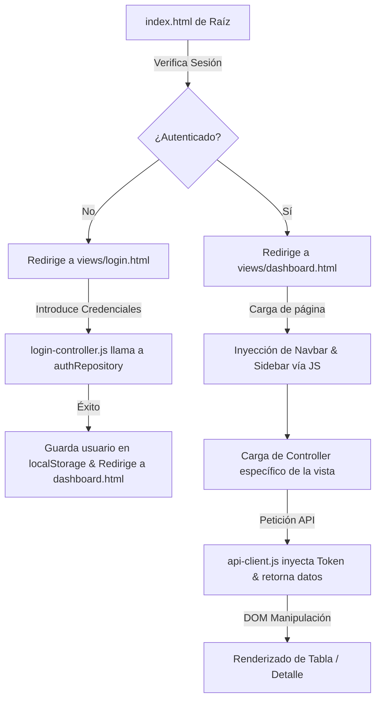

# Guía de Arquitectura y Flujo de la Aplicación

Esta documentación explica de manera sencilla el flujo del frontend implementado y los pasos detallados para agregar una nueva pantalla respetando la estructura limpia del proyecto.

---

## 1. Flujo General de la Aplicación

El programa sigue una secuencia de eventos clara desde que se abre en el navegador:



### Componentes Clave del Flujo:
1. **Redirección Inicial (`index.html`)**: Actúa como un *router perimetral* comprobando la existencia de la sesión en `localStorage`.
2. **Inyección de UI Común**: Cada archivo HTML (excepto `login.html`) incluye contenedores vacíos:
   ```html
   <div id="sidebar-container"></div>
   <div id="navbar-container"></div>
   ```
   Al pie de página, los scripts de tipo módulo `navbar.js` y `sidebar.js` se ejecutan al cargar el DOM, inyectando el menú y verificando que el usuario tenga permisos (por ejemplo, ocultando catálogos si no es administrador).
3. **Consumo Seguro de API (`api-client.js`)**: Encapsula `fetch` y adjunta de forma automática el header `Authorization: QuesitrixSecretSociety` requerido por el backend.

---

## 2. Cómo agregar una Nueva Pantalla (Paso a Paso)

Supongamos que deseas agregar una nueva vista llamada **Historial de Actividades (Auditoría)**. A continuación se detallan los pasos para implementarla:

### Paso 1: Crear la Vista HTML
Crea el archivo [historial.html](file:///c:/xampp/htdocs/ProyectoFinalAPI/Frontend/views/historial.html) en la carpeta `views/`. Debe seguir el mismo layout estándar:

```html
<!DOCTYPE html>
<html lang="es">
<head>
    <meta charset="UTF-8">
    <title>Historial - Mesa de Ayuda</title>
    <link rel="stylesheet" href="../css/main.css">
    <link rel="stylesheet" href="../css/components.css">
    <link href="https://fonts.googleapis.com/css2?family=Outfit:wght@400;500;600;700;800&display=swap" rel="stylesheet">
</head>
<body>
    <div class="app-layout">
        <!-- Contenedor del Menú Lateral -->
        <div id="sidebar-container"></div>
        
        <div class="app-content">
            <!-- Contenedor de la Barra Superior -->
            <div id="navbar-container"></div>
            
            <main class="main-content">
                <div class="page-header">
                    <div>
                        <h1 class="page-title">Historial de Actividades</h1>
                        <p class="page-subtitle">Registro de movimientos y auditoría de tickets</p>
                    </div>
                </div>

                <!-- Tu contenido específico (Ej. una tabla) -->
                <div class="table-container">
                    <table class="table">
                        <thead>
                            <tr>
                                <th>Fecha</th>
                                <th>Usuario</th>
                                <th>Acción</th>
                            </tr>
                        </thead>
                        <tbody id="historial-list">
                            <!-- Inyectado dinámicamente con JS -->
                        </tbody>
                    </table>
                </div>
            </main>
        </div>
    </div>

    <!-- Componentes reutilizables comunes -->
    <script type="module" src="../js/presentation/components/navbar.js"></script>
    <script type="module" src="../js/presentation/components/sidebar.js"></script>
    <!-- Controlador específico de esta vista -->
    <script type="module" src="../js/presentation/controllers/historial-controller.js"></script>
</body>
</html>
```

---

### Paso 2: Definir el Repositorio de Datos (Capa Data)
Si necesitas consumir endpoints especiales de auditoría (por ejemplo, `/historial`), crea el repositorio [historial-repository.js](file:///c:/xampp/htdocs/ProyectoFinalAPI/Frontend/js/data/historial-repository.js):

```javascript
import { apiClient } from '../core/api-client.js';

export const historialRepository = {
    async getLogs() {
        const response = await apiClient.get('/historial'); // Reemplazar por endpoint real del backend
        return response.data || [];
    }
};
```

---

### Paso 3: Crear el Controlador de la Vista (Capa Presentación)
Crea el controlador [historial-controller.js](file:///c:/xampp/htdocs/ProyectoFinalAPI/Frontend/js/presentation/controllers/historial-controller.js). Este archivo conectará los datos con tu interfaz HTML:

```javascript
import { historialRepository } from '../../data/historial-repository.js';
import { entities } from '../../domain/entities.js';

document.addEventListener('DOMContentLoaded', async () => {
    const listContainer = document.getElementById('historial-list');
    if (!listContainer) return;

    try {
        const logs = await historialRepository.getLogs();
        
        if (logs.length === 0) {
            listContainer.innerHTML = `<tr><td colspan="3" class="text-center">No hay registros.</td></tr>`;
            return;
        }

        listContainer.innerHTML = logs.map(log => `
            <tr>
                <td>${entities.formatDate(log.created_at)}</td>
                <td>${log.usuario_nombre}</td>
                <td>${log.accion}</td>
            </tr>
        `).join('');

    } catch (error) {
        console.error(error);
        listContainer.innerHTML = `<tr><td colspan="3" class="text-center" style="color: red;">Error al cargar historial.</td></tr>`;
    }
});
```

---

### Paso 4: Añadir la pantalla al Menú Lateral
Abre [sidebar.js](file:///c:/xampp/htdocs/ProyectoFinalAPI/Frontend/js/presentation/components/sidebar.js). Agrega un icono SVG y la ruta a tu nueva pantalla. 

Ejemplo:
```javascript
const svgHistory = `<svg fill="none" stroke="currentColor" stroke-width="2" viewBox="0 0 24 24" xmlns="http://www.w3.org/2000/svg"><path stroke-linecap="round" stroke-linejoin="round" d="M12 8v4l3 3m6-3a9 9 0 11-18 0 9 9 0 0118 0z"></path></svg>`;

// Si deseas que sólo lo vean administradores, agrégalo en la sección `adminMenuHtml`:
adminMenuHtml += `
    <a href="/proyectofinalapi/Frontend/views/historial.html" class="menu-item ${isActive('historial.html')}">
        ${svgHistory} Historial
    </a>
`;
```

---

### Paso 5: Agregar estilos específicos (Opcional)
Si tu nueva vista requiere clases CSS especiales, agrégalas en [components.css](file:///c:/xampp/htdocs/ProyectoFinalAPI/Frontend/css/components.css) al final del archivo para mantener la centralización y evitar duplicados de estilo en línea.
